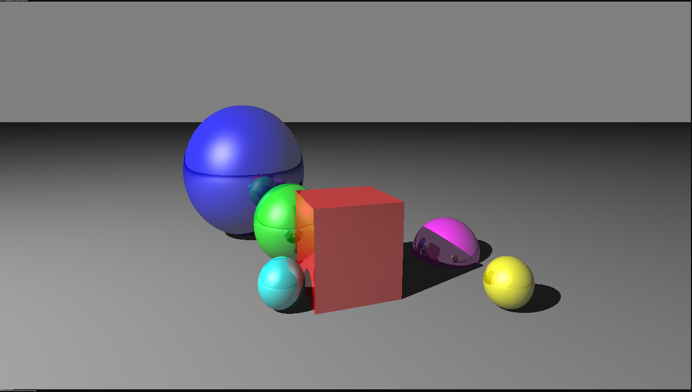
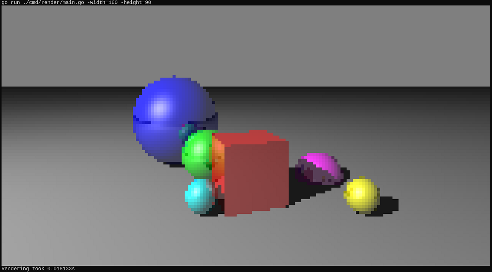

### ASCII Ray-Tracer

Ray-tracing a scene and "printing" the result to the console.
Terminal settings:
- Font: Liberation Mono (for proper dimensions)
- Size: 1 (for high res mode)

#### High-res Test Render

#### Low-res Test Render

